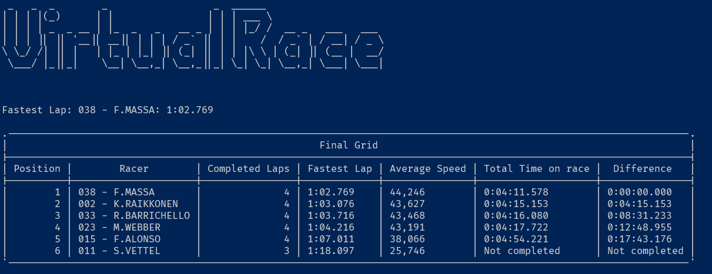
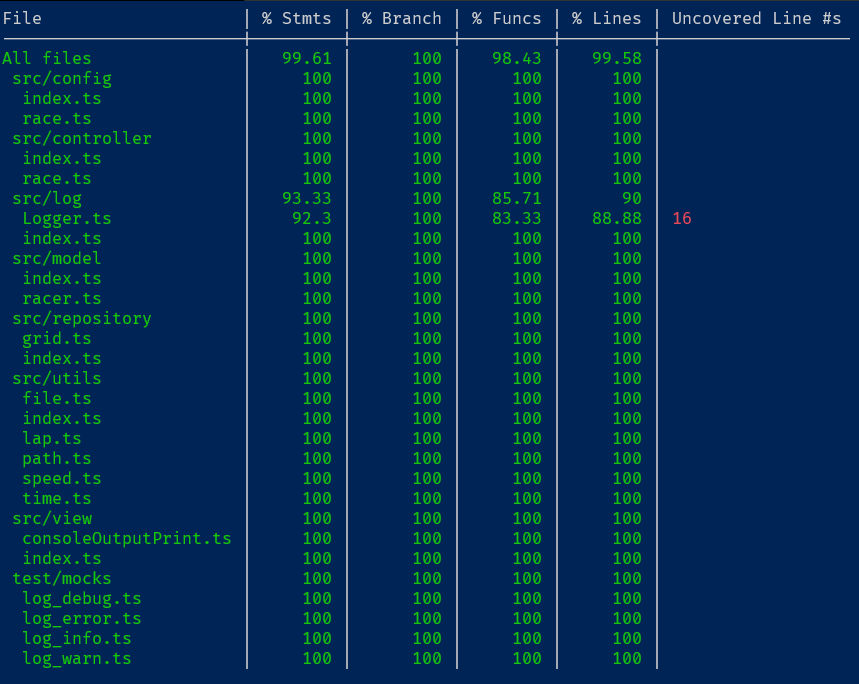

# Virtual Race

This application analysis the results of a race by a log file containing each driver lap stats. 
The application is a command-line application and all the data is persisted on the memory of the runtime. 

## Input data

The log file with the data to be analised must be on the ```data``` directory with the name ```log.txt```. If you want to change the name of the file or the directory, only needs to be changed on the parameter on the ```app.ts``` file.

The file must be with the following format:

```text
Hora                               Piloto             Nº Volta   Tempo Volta       Velocidade média da volta
23:49:08.277      038 – F.MASSA                           1		1:02.852                        44,275
23:49:10.858      033 – R.BARRICHELLO                     1		1:04.352                        43,243
23:49:11.075      002 – K.RAIKKONEN                       1             1:04.108                        43,408
23:49:12.667      023 – M.WEBBER                          1		1:04.414                        43,202
23:49:30.976      015 – F.ALONSO                          1		1:18.456			35,47
23:50:11.447      038 – F.MASSA                           2		1:03.170                        44,053
23:50:14.860      033 – R.BARRICHELLO                     2		1:04.002                        43,48
23:50:15.057      002 – K.RAIKKONEN                       2             1:03.982                        43,493
23:50:17.472      023 – M.WEBBER                          2		1:04.805                        42,941
23:50:37.987      015 – F.ALONSO                          2		1:07.011			41,528
23:51:14.216      038 – F.MASSA                           3		1:02.769                        44,334
23:51:18.576      033 – R.BARRICHELLO		          3		1:03.716                        43,675
23:51:19.044      002 – K.RAIKKONEN                       3		1:03.987                        43,49
23:51:21.759      023 – M.WEBBER                          3		1:04.287                        43,287
23:51:46.691      015 – F.ALONSO                          3		1:08.704			40,504
23:52:01.796      011 – S.VETTEL                          1		3:31.315			13,169
23:52:17.003      038 – F.MASS                            4		1:02.787                        44,321
23:52:22.586      033 – R.BARRICHELLO		          4		1:04.010                        43,474
23:52:22.120      002 – K.RAIKKONEN                       4		1:03.076                        44,118
23:52:25.975      023 – M.WEBBER                          4		1:04.216                        43,335
23:53:06.741      015 – F.ALONSO                          4		1:20.050			34,763
23:53:39.660      011 – S.VETTEL                          2		1:37.864			28,435
23:54:57.757      011 – S.VETTEL                          3		1:18.097			35,633

```

>Note:
>In the file you must remove the header line.


## Output

After the execution, is going to be printing something like this on the console:




## Configuration

For run this application you must have installed on your machine:

* Node
* Yarn

You must create a ```.env``` file on the project root, with the same variables on the ```.env-example```.
Has only one enviroment variable named ```NUM_OF_LAPS```, that is to specify the number of the laps of the race, in this case was used as ```4```.

If is already installed on your machine, just run the following command to install the dependencies:

```bash
yarn
```

And after for running the application:

```bash
yarn start
```

## Architeture

The software was built using the clean architeture principles. Resulting in a application with low coupling and resilient. 

The application is separated in modules, each one doing some functionality and independent of each other. This helps for future grow of the project and new implementations without need of rewrite the whole application.

In the following is an ilustrated represention of how the geeral architeture works in this application:


On the input, the application start on the most external layer and goes to the most internal one. And as the response goes to the opposite direction, returning to where it started.

Here is some information about the modules on this application:

* <b>config</b>: Where is loaded all the enviroment variables on the ```.env``` file;
* <b>contract</b>: Contain some interfaces used as data types that flows the data between the modules. This strategy is used to prevent circular dependencies on the modules;
* <b>controller</b>: Responsible to input the commands of the user and output the responses information;
* <b>log</b>: Classes used to create the logs on the application, to inform errors and issues on the application;
* <b>model</b>: The entities of the application, when all the business rules are managed;
* <b>view</b>: Where is going to format and style the UI that is going to output the data for the user;
* <b>repository</b>: Where is stored the data and all the persistances operations are made;
* <b>utils</b>: Utilitary classes that help to do some small operations that are not directly envolved on the general logic of the app.

## Tests

The application was made using the TDD (Test Drive Development) approach, testing each functionality and situation competly isolated of the rest, all the logic was built starting by the tests. This helps the development be more centered on building a solid logic of the application and after manage how it flows.

The tests coverage a total of <b>99%</b> of the functionalities of the application. Coveraging all the situations and the logics possible to this implementation. 

You can run the tests with the following command:

```bash
yarn test
```

The output of the test is going to be like this:




The use of tests is very important on the now-a-days software development, because with them when you make changes on the code, you are going to be a warranty if this will break some other logic or not.

